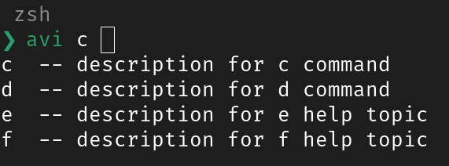

# ZSH Custom Completions

invokation and usage

```
$ cmd <TAB><TAB>
```

## descriptions

| function   | descriptions                                                                                                                                                 |
| ---------- | ------------------------------------------------------------------------------------------------------------------------------------------------------------ |
| \_describe | This function associates completions with descriptions. Multiple groups separated by -- can be supplied, potentially with different completion options opts. |



### Resources

- [Howto zsh completion](https://github.com/zsh-users/zsh-completions/blob/master/zsh-completions-howto.org)
